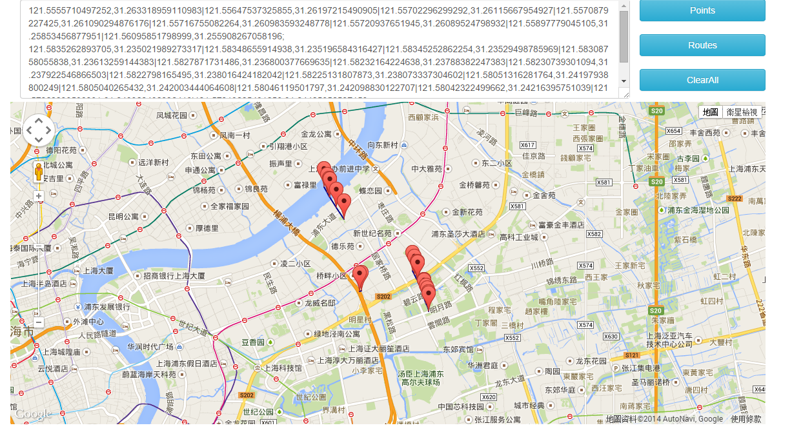

# Google Map Demo

This is a very simple demo to show trajectory with help of google map api.

Open the index.html. You will get:

## Usage

### Input Format

The input format is as:

    textarea = trajectory[;|\n]trajectory[;|\n]trajectory ...
    trajectory = location|location|location ...
    location = longitude,latitude

Every input may contain several trajectories seperated by `'` or `\n`.
Every trajectory contains a serials of locations, which is separated by `|`.
Every location is composed with longitude and latitude in the form of `longitude,latitude`.

### Buttons

The Points Button is to plot every gps point in the trajectories on the map. After plotting, the map will be centered to 
the geometry center of those points.

The Routes Button is to plot every trajectory with a blue line on the map. After plotting the amp will be centered to the 
last plotted trajectory's geometry center.

The ClearAll Button will clean up all those plotted layers.